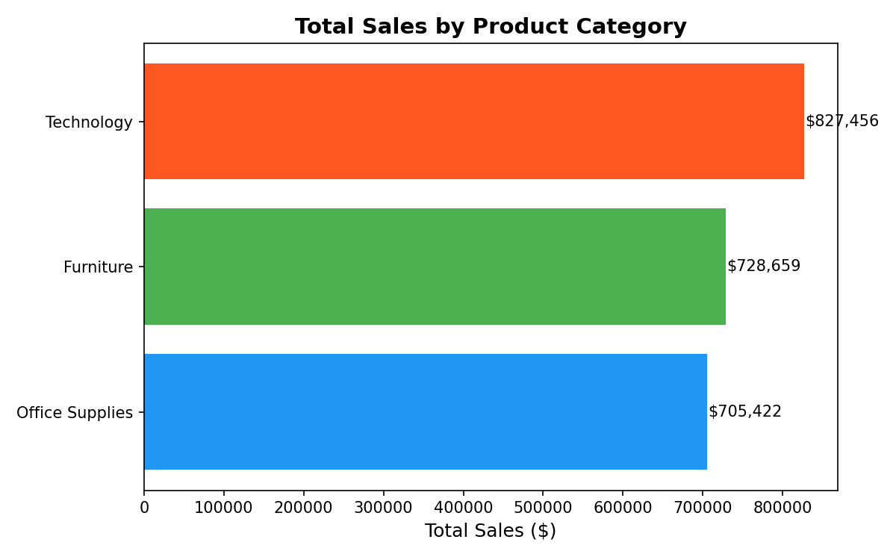
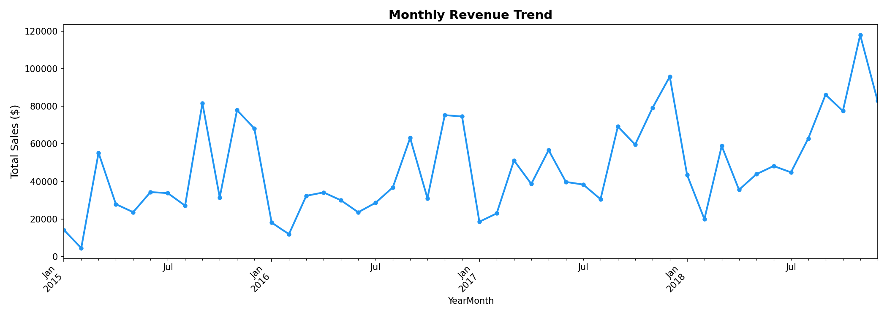
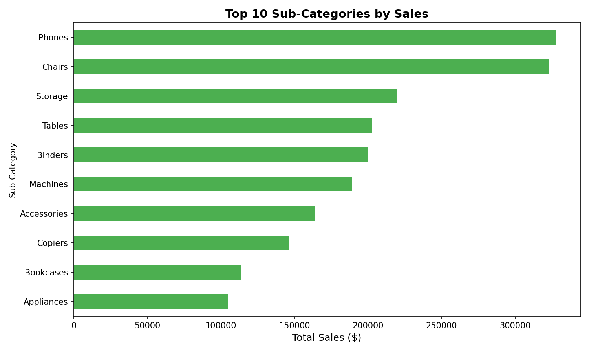
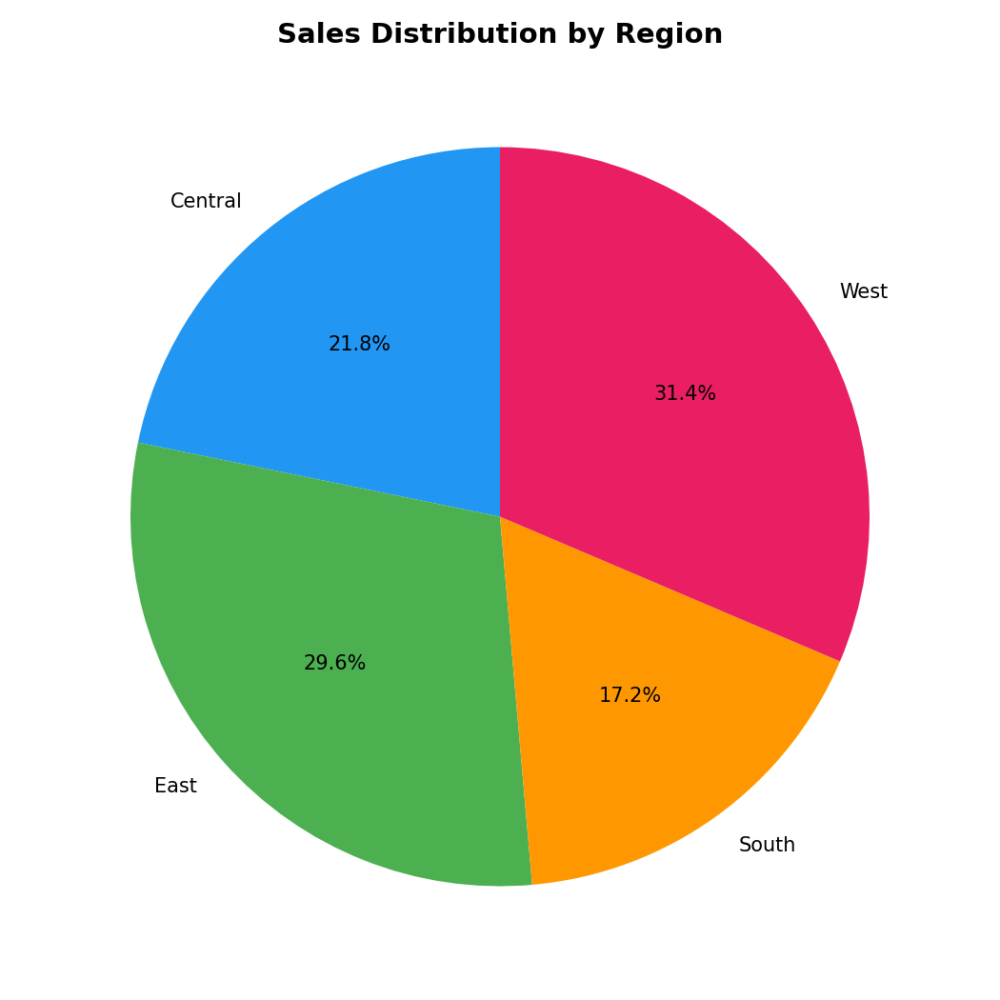

# superstore-sales-analysis
Python data analysis project — exploring sales trends, regional performance, and product insights from 9,800 Superstore orders using Pandas and Matplotlib.
# Superstore Sales Analysis

Analysed 9,800 retail orders from a US Superstore using Python to uncover revenue trends, regional performance, and top product categories.

## Key Findings
- Technology is the highest revenue category
- Q4 shows consistent 25-35% sales spike every year
- West region leads all regions in total sales
- Phones and Chairs are the top-performing sub-categories

## Charts

## Tools
Python | Pandas | Matplotlib | Seaborn | Google Colab
